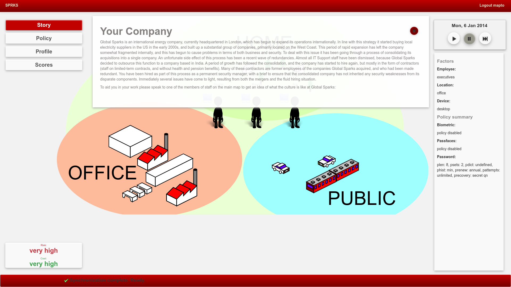
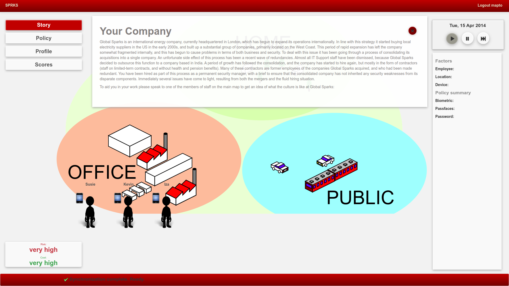
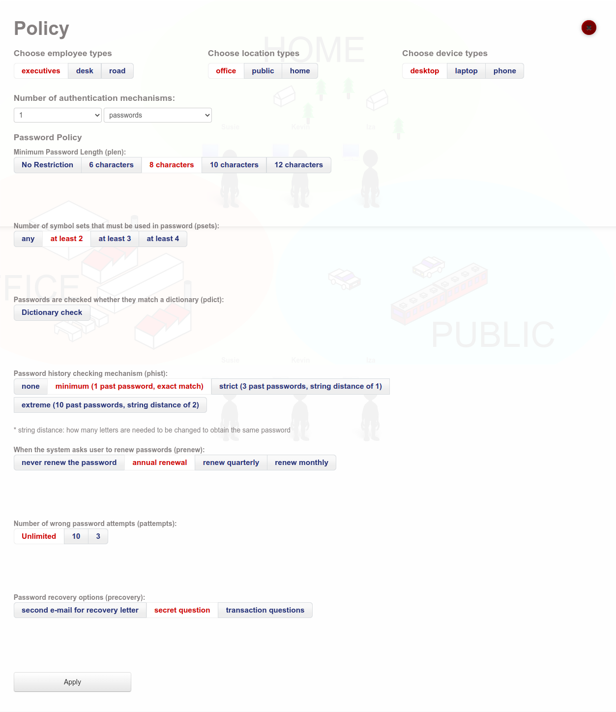
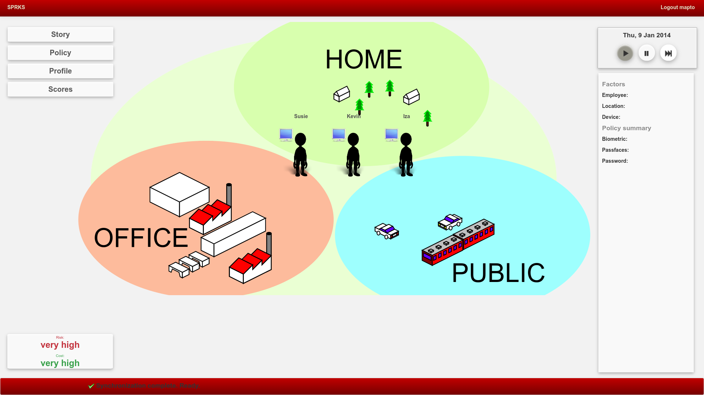
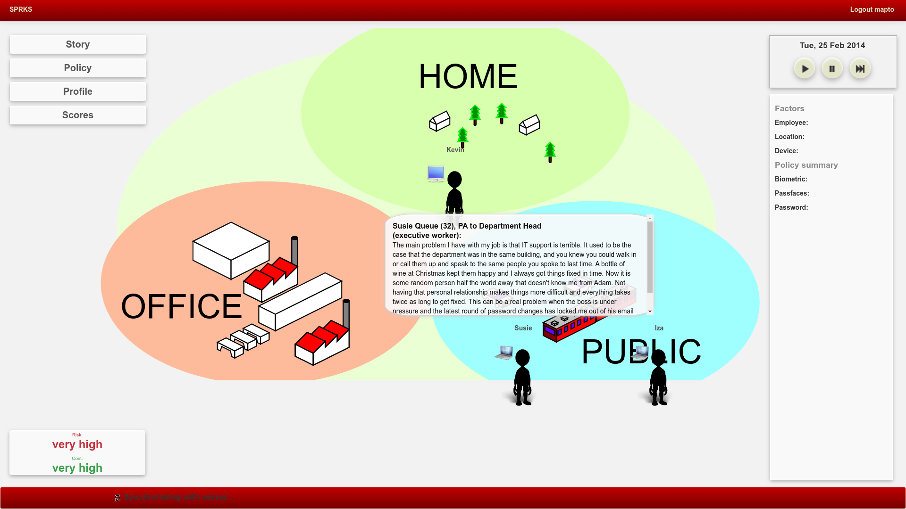
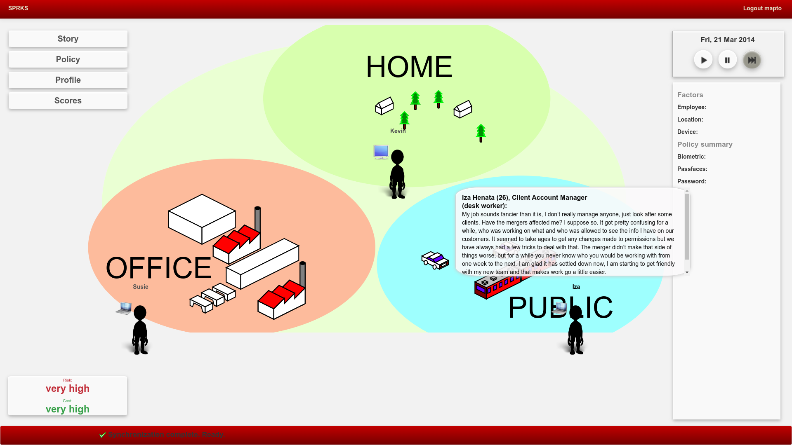
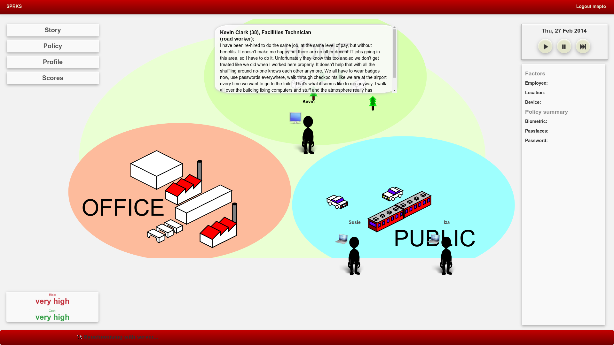
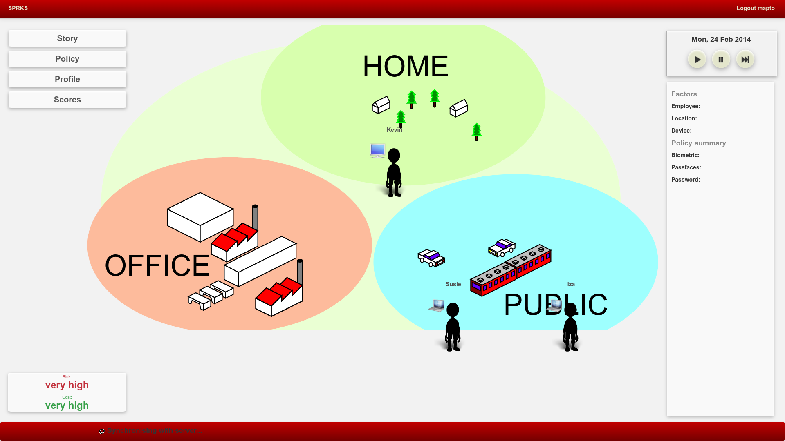
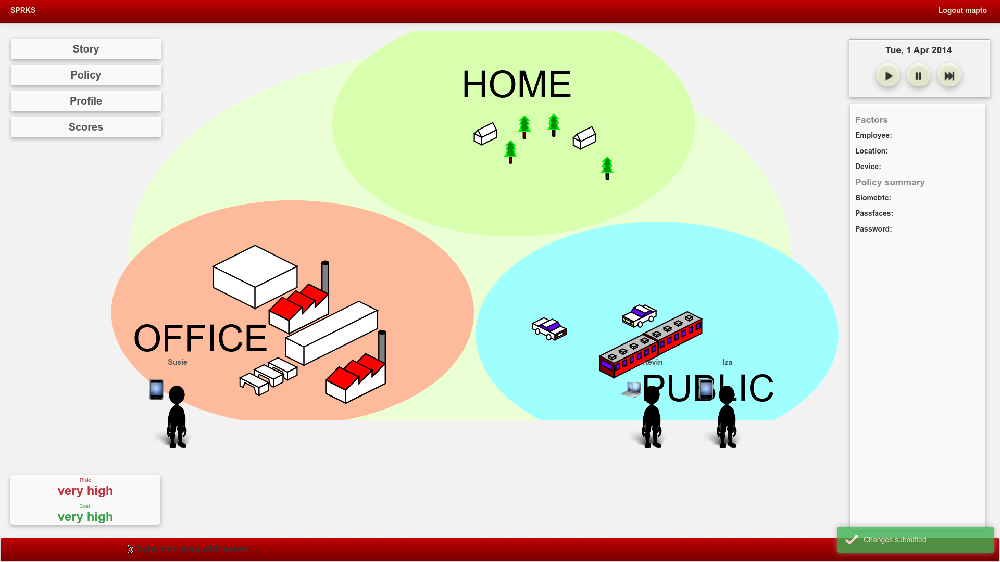

# Game overview

SPRKS stands for Security Policy Risk Simulator. It is intended to give novice security managers practical insights of the interplay of technical, usability and contextual aspects of security. In particular, it focuses on the implications of choices regarding the company authentication policy. 

When users open the game site, they need to authenticate. Once logged in, they see the [game story](../views/index.html#L231), introducing into the company that is the context of the game.

Then the players can explore the game interface. At this point, there are two points of interaction:

  1. Company security policy - where the players makes their choices 
  2. Game map and characters - where they can get feedback about the consequences of their decisions
 
 Through the menu on the left, a company security policy could be set.
 Policies are specified for 27 different contexts, defined by combinations of the following:
 
   1. employee: executive, desk, road
   2. location: office, public and home
   3. device: desktop computer, laptop, phone

The game map correspondingly shows the three different spaces: office, public and home.
In the lower left corner there are score indicators, showing the risks and costs of the currently chosen security policy.
On the right-hand site is the toolbar, which allows control of time speed, and an overview of the selected security policy.

When the player clicks on game characters (one for each respective role: executive, desk, road), they express their opinions.

Once the player starts the time, the game characters start moving throughout the game space and changing devices (desktop computer, laptop, phone).
Employees express their opinions and eventually risks materialise, depending on employees current context (their role, location and used device).

With time, and in consequence of the security policy, various incidents start occuring.
An overview of possible incidents could be seen in a [dedicated notebook](summarise-incidents.ipynb).
