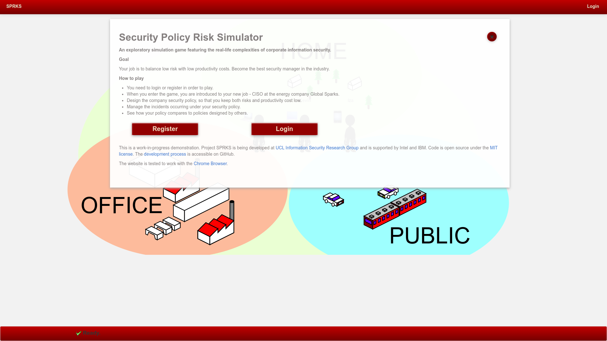
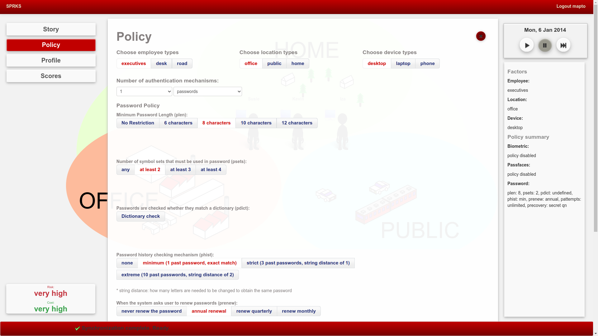
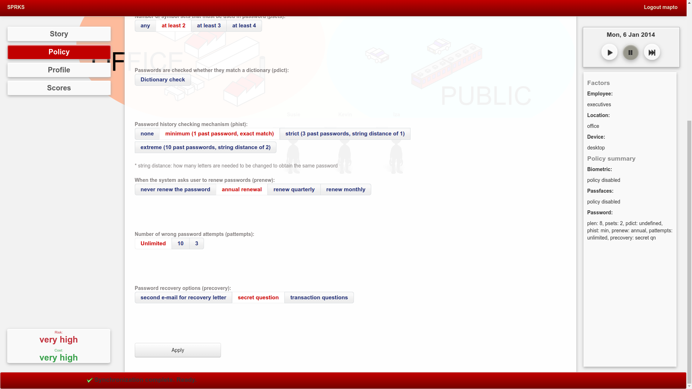

# Game overview

When users open the game site, they see the login screen

Once logged in, they see the game story, introducing into the company that is the game context.

Then the players can explore the game interface. At this point, there are two useful pieces of information:

  1. Company security policy
  2. Game map and characterx
 
 Through the menu on the left, a company security policy could be set.
 Policies are specified for 27 different context by types:
 
   1. 3 employee: executive, desk, road
   2. 3 location: office, public and home
   3. 3 device: desktop computer, laptop, phone

The game map shows three different map domain spaces: office, public and home.
In the lower left corner an indication of current risks and costs is shown.
On the right-hand site is the toolbar, which allows control of time, and an overview of the current security policy.

When the player clicks on game characters, they express their opinions.

Once the player starts the time, the game characters start moving throughout the game space and changing devices.

With time, and in consequence of the security policy, various incidents start occuring. An overview of possible incidents could be seen in a [dedicated notebook](summarise-incidents.ipynb).
